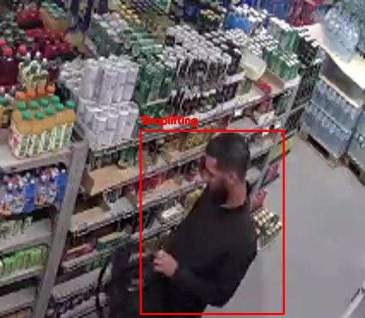

# Shoplifting Detection System (v3)

## Overview

The Shoplifting Detection System is designed to identify shoplifting activities using advanced machine learning techniques. This project leverages computer vision and temporal memory to detect suspicious activities in real-time.

## What's New in v3

This version (v3) builds upon the improvements introduced in v2 and incorporates the following enhancements:

- **YOLO Integration**: YOLO is now used to detect and crop human bounding boxes before feature extraction and temporal analysis.
- **v2 Features**:
  - **CNN** (ResNet50) for feature extraction.
  - **LSTM** for temporal memory to analyze sequences of video frames.
  - Transitioned from image data to **video data**, which is preprocessed and converted into NumPy arrays for training and inference.

## Features

- Real-time detection of shoplifting activities.
- YOLO-based human detection for precise bounding boxes.
- Pre-trained weights for quick deployment.
- Configurable training and inference scripts.
- Improved accuracy with temporal memory and video-based analysis.

## Output Example

Below are examples of the system's output, showcasing real-time shoplifting detection:

### Processed Image



### Processed Video


## Project Structure

```
shoplifting_detection/
├── preprocess_data.py  # Script for preprocessing video data into NumPy arrays
├── train_model.py      # Script for training the model
├── test_model_on_video.py  # Script for running inference on video data
model/
├── shoplifting_detector.pth
```

## Getting Started

### Prerequisites

- Python 3.8 or higher
- Required libraries (install via `requirements.txt` if available)

### Training the Model

To train the model, run the following command:

```bash
python train_model.py
```

### Running Inference

To run inference on a video, use:

```bash
python test_model_on_video.py
```

## Data

https://data.mendeley.com/datasets/r3yjf35hzr/1

The project uses the "Shoplifting Dataset (2022) - CV Laboratory MNNIT Allahabad" which contains:

- **Normal**: Contains video data of normal activities.
- **Shoplifting**: Contains video data of shoplifting activities. This data was has been refined for better training. Original was "Shoplifting Raw".

### Data Preprocessing

The video data is preprocessed and converted into NumPy arrays for efficient training and inference. The preprocessing steps include:

1. Using YOLO to detect and crop human bounding boxes.
2. Resizing frames to a fixed resolution.
3. Normalizing pixel values.
4. Converting video sequences into NumPy arrays.

The `preprocess_data.py` script handles this preprocessing and organizes the data for training and testing.

## License

This project is licensed under the MIT License. See the LICENSE file for details.

## Acknowledgments

- Open-source libraries and frameworks used in this project.
- Contributors and collaborators.
